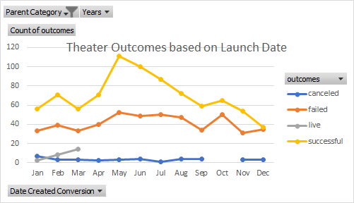
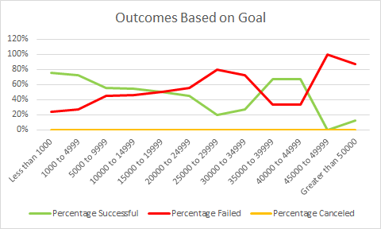

# Kickstarting with Excel

## Overview of Project
* We have been hired by Louise, a playwright, to analyze the outcomes of other Kickstarter play campaigns based on their launch dates and funding goals. 

### Purpose
* The purpose of this analysis to provide numerical and visual data to Louise so that she can compare how her campaign is faring with other other Kickstarter campaigns based on funding goals and launch dates.
## Analysis and Challenges

### Analysis of Outcomes Based on Launch Date

* For this analysis, I pulled the data into a pivot table in order to sort and filter the data that would be needed in the chart.  A "Line with Markers" chart was used becuase the line graph helps you to easily ascertain outcomes based on launch dates varying by month. The markers help you to more easily pinpoint the values along the lines.
### Analysis of Outcomes Based on Goals

* In order to analyze outcomes based on funding goals, I had to make a subset of data in order to group the campaigns based on funding goal intervals. This grouping then allowed for a much clearer visualization of the data. I used multiple formulas including, COUNTIFS and SUM. 
### Challenges and Difficulties Encountered
1. While I had no challenges with this project, there are some difficulties that could slow you down tremendously. For instance, when working on pulling the subset of data for the Outcomes Based on Goals chart, you would need to know how to nest your formulas so that the columns don't automatically change when copying the formula to another cell. This saves you a ton of time when replicationg a formula throughout the sheet.
2. Another challenge could have been learning how to use the "COUNTIFS" formula properly. Having to make the formula count based on more than one range is slightly more difficult to set up.
## Results

- What are two conclusions you can draw about the Outcomes based on Launch Date?
    1. Theater campaigns are most often succesful when launched in May, June, or July (in that order).
    2. The margin between failure and success rates is much lower during the first and last four months of the year. Summer is the time to launch a campaign!
- What can you conclude about the Outcomes based on Goals?
    1. The majority of Play campaigns have funding goals of 35,000 or less. When looking at just these campaigns, it seems that as the funding goal trends up, the success rate trends down. 
    2. There were only nine campaigns with a funding goal between 35,000 and 45,000. These campaigns were surprisingly successful and it makes me question whether they are a sort of outlier or fluke.
    3. The gap between failure and success rate seems to be extreme after passing 45,000 as the funding goal. With failure trending upward as the goal increases.
- What are some limitations of this dataset?
    * One of the limitations of the dataset used in the Outcomes Based on Lanch Date is that it may be too broad. We filtered by the Parent Catgory of "Theater" instead of using the subcategory of "plays" which would have been more relevant to Louise's campaign.
    * This dataset is taken from almost a ten year time span of Kickstarter data. There can also be seasonality based on years and not just months. Society may have been more or less interested in plays over that span of time.
    * There are many countries taken into account and interest in plays, as well as money available, can vary by country or even by region within a specific country.
- What are some other possible tables and/or graphs that we could create?
    * A Stacked Column Bar Graph would be beneficial for the Outcomes Based on Goals data. This would allow you to ascertain which campaigns were had higher rates of success vs failure.
